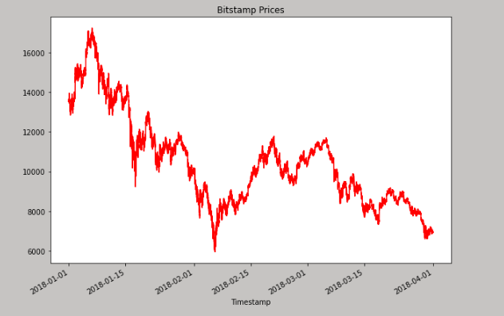
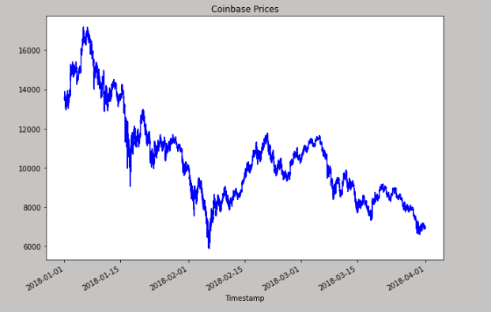
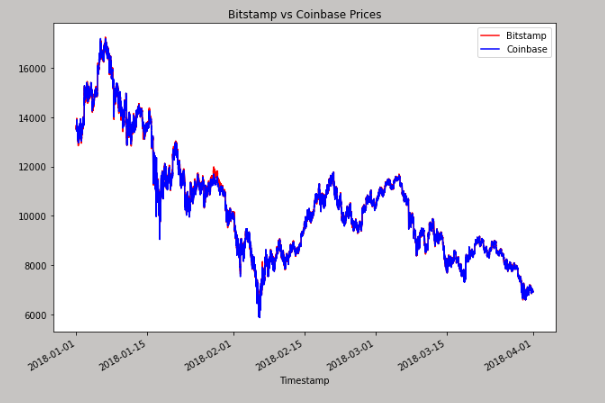

# Module 3 Challenge - Application to sort through historical trade data for Bitcoin on two exchanges: Bitstamp and Coinbase

This is a python command-line interface application that sorts through historical trade data for Bitcoin on two exchanges: Bitstamp and Coinbase. The three phases of financial analysis(data collection, preparation, and analysis) is used to determine if any arbitrage opportunities exist for Bitcoin.

---

## Examples

Bitstamp gragh for all time


Coinbase gragh for all time


Bitstamp vs Coinbase prices gragh for all time

---

## Usage

To use the loan qualifier application simply clone the repository and run the **app.py** with:

```python
python app.py
```

Upon launching the loan qualifier application you will be greeted with the following prompts.


---

## Contributors

Brought to you by Neha Jantre.

---

## License

MIT
